# Hello! I'm Sira ✨

🎓 Graduate in **Computer Engineering** and currently specialising in **Cybersecurity** through a Masters. 
💻 **Junior Developer** in Grupo Iris, developing software in a team for the travel sector. 
💡 Specially interested in **app development**, **cybersecurity** and **continuous learning**. 
🌍 International experience and multicultural environment (United Kingdom, International Baccalaureate, Sweden). 
🔹 Bilingual **Spanish / English**.  

---

## 🛠️ Tech Stack  

**Programming Languages**  

**Frameworks & Libraries**  

**Databases**  

**Tools & Others**  

---

## 💼 Experience

### 👩‍💻 Junior Developer — Grupo Iris
Software development as part of a team for a platform oriented to travel agencies and the travel sector.
- 🤝 Collaborative work within a development team.
- 💻 Development and maintenance of functionalities.
- 🔄 Use of version control and collaboration tools.
- 🛠️ Participation in the development of applications and services designed for real-world environments.

---

## 🔐 Currently Learning
I am currently specialising in **Cybersecurity** through the **Master's in Cybersecurity at University West** (Sweden).
- 🛡️ **Cybersecurity Principles** — threats, vulnerabilities, access control, cryptography, network security, firewalls, system monitoring and protection.
- 🌐 **Network and System Security** — analysis of communications, vulnerabilities, and defense mechanisms.
- 🏭 **Cyber-Physical Systems Security** — IoT, industrial systems, and connected devices.
- ☁️ **Cloud Security** — security for cloud services, identities, and access control.
- 🤖 **AI-Driven Risk Assessment and Management**.
- 🕵️ **Ethical Hacking, Penetration Testing & IT Forensics**.
- ⚖️ **Privacy, Legislation, Policies, and Cybersecurity Compliance**.

---

## 🚀 Featured projects

### 📱 Interactive NFC Portfolio
Interactive web portfolio designed to function as my digital business card via NFC.
- 📲 Direct access to the portfolio via an NFC sticker.
- 👩‍💻 Presentation of my profile, experience, and skills.
- 📬 Integrated contact forms.
- 💻 Technologies: HTML · CSS · JavaScript · NFC

🔗 [View repository](https://github.com/siraglez/portfolio) | [View portfolio online](https://siraglez.github.io/portfolio/projects.html)

---

### 🍽️ Weekly Menu App (In development) 
Weekly menu generator customised with **Swift** and **SwiftUI**, developed using Apple's **Xcode** IDE.  
- 📱 Adapted for iOS 
- 👤 Supports user preferences  
- 🗄️ Recipe and menu management  
- 💻 Technologies: Swift · SwiftUI · SwiftData

🔒 *(Private repository – in development)*

---

### 📄 WebCV
Transforming my résumé into a modern, interactive web experience.
- 🎨 **Responsive** design adapted for all devices.
- ✨ Clean interface with CSS animations.
- 📥 Option to download the PDF version.
- 💻 Technologies: HTML5 · CSS3 · JavaScript

🔗 [View repository](https://github.com/siraglez/webCV.git) | [View website online](https://siraglez.github.io/webCV/)

---

### 🌍 LoveTripWeb  
Publicly available website for travel management and itinerary planning.  
- 🧭 Route and trip planning  
- 📅 Day-by-day itinerary management  
- 💻 Responsive for desktop and mobile  
- 🛠️ Technologies: React · HTML · CSS · JavaScript  

🔗 [View repository](https://github.com/siraglez/LoveTripWeb) | [View website online](https://siraglez.github.io/LoveTripWeb/)

---

## 📊 GitHub Statistics
 
 
 

---

## 🌐 Connect with me

  
 

---

